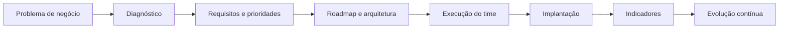
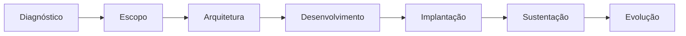

<div align="center">

<br>

# Gustavo Lemos

### Liderança de Tecnologia · Produtos · Projetos · Transformação Digital

**Conectando pessoas, negócio, dados e engenharia para transformar desafios em soluções escaláveis.**

<br>

[](https://updatecommit.com)
[](https://www.linkedin.com/in/guslemos/)
[](mailto:gustavo.lemos@updatecommit.com)
[](https://wa.me/5521936185311)

<br>

`Tecnologia` · `Gestão` · `Produtos` · `Dados` · `Inteligência Artificial`

📍 Rio de Janeiro, Brasil

<br>

</div>

---

## Sobre mim

Sou **líder de tecnologia** e fundador da **UpdateCommit**, com uma trajetória construída dentro da operação: da execução técnica à liderança de times, produtos e projetos estratégicos.

Minha atuação está na conexão entre:

<table>
<tr>
<td align="center"><strong>👥 Pessoas</strong><br>Liderança, desenvolvimento e autonomia</td>
<td align="center"><strong>📦 Produtos</strong><br>Descoberta, construção e evolução</td>
<td align="center"><strong>⚙️ Engenharia</strong><br>Arquitetura, qualidade e confiabilidade</td>
<td align="center"><strong>📊 Negócio</strong><br>Resultados, eficiência e estratégia</td>
</tr>
</table>

Lidero iniciativas envolvendo **ERP, CRM, Business Intelligence, integrações, automação, infraestrutura, dados e Inteligência Artificial**.

Minha experiência técnica me permite participar de decisões de arquitetura, avaliar trade-offs e apoiar o time de engenharia sem perder de vista o principal objetivo:

> **Transformar necessidades de negócio em soluções tecnológicas estruturadas, sustentáveis e mensuráveis.**

---

## Como transformo necessidades em entregas



Minha atuação combina estratégia, delivery e profundidade técnica:

* Liderança de times e desenvolvimento de pessoas
* Gestão de projetos, produtos e prioridades
* Transformação digital e modernização de sistemas
* Arquitetura de software e decisões técnicas
* ERP, CRM e plataformas corporativas
* APIs, webhooks e integração entre sistemas
* Dados, indicadores e Business Intelligence
* Inteligência Artificial aplicada ao negócio
* Automação de processos e workflows
* DevOps, CI/CD e infraestrutura de aplicações

---

## Liderança e resultados

Na minha atuação atual, sou responsável pela organização da operação de tecnologia, priorização das demandas e evolução do time técnico.

<table>
<tr>
<td align="center">

### +300

Demandas de tecnologia gerenciadas

</td>
<td align="center">

### 88%

Das demandas concluídas no primeiro semestre de 2026

</td>
<td align="center">

### 70%

Das solicitações resolvidas em até sete dias

</td>
<td align="center">

### +8

Áreas de negócio atendidas

</td>
</tr>
</table>

Principais responsabilidades:

* Formação e liderança de time técnico interno
* Realização de 1:1s, feedbacks e acompanhamento de evolução
* Definição de prioridades, roadmap e capacidade de entrega
* Gestão de incidentes e problemas críticos
* Coordenação de projetos, integrações e melhorias
* Comunicação entre tecnologia, liderança e áreas de negócio
* Tradução de necessidades operacionais em soluções estruturadas
* Criação de indicadores para acompanhamento de desempenho

Acredito que liderança não significa concentrar todas as respostas.

Significa criar clareza, remover bloqueios e construir um ambiente no qual as pessoas consigam tomar boas decisões e entregar valor com consistência.

---

# Projetos e experiências

## Transformação de tecnologia corporativa

**ERP · Processos · Sistemas internos · Integrações**

Participei da implantação, estabilização e evolução contínua do **ERP Sankhya**, apoiando processos de diferentes áreas da organização:

`Comercial` · `Financeiro` · `Fiscal` · `Logística` · `Compras` · `RH` · `Garantia` · `E-commerce`

Principais frentes de atuação:

* Mapeamento e revisão de processos
* Implantação e evolução de módulos do ERP
* Customizações e regras de negócio
* Integração entre sistemas corporativos
* Automação de atividades manuais
* Gestão e resolução de incidentes
* Priorização de demandas técnicas
* Relatórios, dados e indicadores
* Alinhamento entre tecnologia e operação

---

## CRM interno e inteligência comercial

**Produto · Dados · Business Intelligence**

Desenvolvimento e evolução de soluções internas de CRM e BI integradas ao ERP, ampliando a visibilidade sobre a operação comercial.

As soluções apoiam o acompanhamento de:

* Cotações e oportunidades
* Carteira e comportamento dos clientes
* Produtividade dos vendedores
* Desempenho por equipe e gerente
* Indicadores de vendas
* Conversão e evolução comercial
* Informações para tomada de decisão

---

## Ecossistema de integrações

**APIs · Webhooks · ERP · E-commerce · Marketplaces**

Desenvolvimento e coordenação de integrações entre sistemas corporativos, plataformas digitais, serviços financeiros e canais de atendimento.

### Plataformas e ambientes

`Sankhya ERP` · `Mercado Livre` · `VNDA` · `Intelipost` · `Equals` · `Suri` · `n8n` · `WhatsApp` · `APIs financeiras` · `APIs logísticas`

### Conceitos aplicados

`REST APIs` · `Webhooks` · `ETL/ELT` · `Filas` · `Jobs` · `Autenticação` · `Regras de negócio` · `Observabilidade`

---

## Inteligência Artificial aplicada

Utilizo Inteligência Artificial como ferramenta para aumentar produtividade, melhorar processos e criar novas experiências digitais.

Algumas aplicações:

* Assistentes para apoio comercial
* Automação de atendimento
* Análise e classificação de documentos
* Integração de sistemas com LLMs
* Agentes e workflows automatizados
* Orquestração de processos com n8n
* IA aplicada ao desenvolvimento de software
* Recursos inteligentes em produtos SaaS

Meu foco não está em utilizar IA apenas como demonstração tecnológica.

Busco aplicações que produzam impacto concreto em:

<table>
<tr>
<td align="center">⚡<br><strong>Produtividade</strong></td>
<td align="center">🤖<br><strong>Automação</strong></td>
<td align="center">💬<br><strong>Experiência</strong></td>
<td align="center">📈<br><strong>Decisão</strong></td>
</tr>
</table>

---

# UpdateCommit

<div align="center">

### Software, integrações, automação e produtos digitais.

[](https://updatecommit.com)

</div>

Sou fundador da **UpdateCommit**, empresa de tecnologia focada na construção de soluções sob medida e produtos digitais.

Atuo em todo o ciclo dos projetos:



### Soluções desenvolvidas

* Produtos SaaS
* Sistemas corporativos
* Integrações com ERPs
* Integrações com marketplaces
* Integrações financeiras e logísticas
* APIs e webhooks
* Plataformas de automação
* Dashboards e indicadores
* Soluções com Inteligência Artificial

---

## Plataforma SaaS de NFS-e

Desenvolvimento de uma plataforma SaaS para emissão e gestão de **Nota Fiscal de Serviço eletrônica**.

### Principais capacidades

* Emissão de NFS-e
* Emissão recorrente
* Gestão multiempresa
* API REST
* Webhooks
* Certificados digitais
* Processamento de XML e documentos
* Integrações fiscais
* Infraestrutura de aplicação
* Monitoramento e sustentação

Este produto reúne diferentes dimensões da minha atuação:

```text
Produto
  +
Arquitetura de software
  +
Integrações
  +
Regras fiscais
  +
Operação SaaS
```

---

# Minha visão sobre liderança

Times de tecnologia de alta performance precisam equilibrar quatro dimensões.

| Dimensão       | Princípios                                                           |
| -------------- | -------------------------------------------------------------------- |
| **Pessoas**    | Desenvolvimento, autonomia, feedback, confiança e colaboração        |
| **Delivery**   | Prioridades claras, planejamento realista, visibilidade e resultados |
| **Engenharia** | Qualidade, segurança, arquitetura, confiabilidade e manutenção       |
| **Negócio**    | Impacto para clientes, operação, eficiência e estratégia             |

Meu papel como líder é conectar essas dimensões e garantir que tecnologia seja um habilitador do negócio, não apenas uma área de suporte.

---

# Stack e background técnico

Mantenho proximidade técnica suficiente para compreender desafios de engenharia, discutir arquitetura e apoiar decisões do time.

## Backend


## Frontend


## Dados e bancos


## Infraestrutura e DevOps


## Automação e IA


---

# Estudos e evolução

Atualmente estou aprofundando conhecimentos em:

* Engenharia de Dados
* System Design
* Arquitetura de Software
* Sistemas distribuídos
* Cloud e Platform Engineering
* SRE e observabilidade
* Agentes de IA e arquiteturas com LLMs
* Engineering Management
* Métricas e governança de tecnologia
* Design Patterns

Atualmente curso uma **Pós-graduação em Engenharia de Dados**.

---

# Formação

| Formação                                                        | Instituição                     |
| --------------------------------------------------------------- | ------------------------------- |
| **Pós-graduação em Engenharia de Dados**                        | Descomplica Faculdade Digital   |
| **Pós-graduação em Inteligência Artificial e Machine Learning** | XP Educação                     |
| **Análise e Desenvolvimento de Sistemas**                       | Descomplica Faculdade Digital   |
| **Tecnólogo em Processos Gerenciais**                           | Universidade Federal Fluminense |

Essa combinação representa a forma como enxergo tecnologia:

<div align="center">

### Gestão + Tecnologia + Dados + IA + Negócio

</div>

---

# GitHub e portfólio técnico

Este perfil reúne projetos, estudos, experimentos e referências relacionadas aos temas em que atuo.

### Por aqui você encontrará

* APIs e integrações entre sistemas
* Automação de processos
* Backends com Java, Go, Node.js e Python
* Aplicações web e produtos digitais
* Estudos de arquitetura e engenharia de software
* Inteligência Artificial aplicada a problemas de negócio
* Projetos e experimentos de Engenharia de Dados

> Parte significativa do meu trabalho não pode ser publicada devido a contratos, propriedade intelectual, segurança e proteção de dados de clientes. Por isso, este GitHub apresenta uma amostra da minha atuação técnica e dos assuntos que estudo e desenvolvo.

<div align="center">

<br>

[](https://github.com/GustavoLemosUp)

<br>

---

### Tecnologia com visão de negócio.

**Soluções estruturadas. Entregas sustentáveis. Evolução contínua.**

<br>

[](https://www.linkedin.com/in/guslemos/)
[](https://updatecommit.com)
[](mailto:gustavo.lemos@updatecommit.com)

</div>
