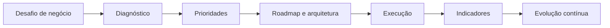
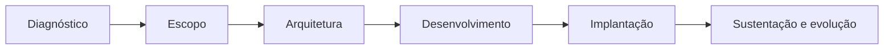

# Gustavo Lemos

### Liderança de Tecnologia · Produto · Projetos · Transformação Digital

**Conecto pessoas, negócio, dados e engenharia para transformar desafios em soluções escaláveis.**

 

 

`Liderança de Tecnologia` · `Produtos` · `Dados` · `Integrações` · `Inteligência Artificial`

📍 Rio de Janeiro, Brasil · 🌎 Atuação nacional

---

## Sobre mim

Sou **líder de tecnologia** e fundador da **UpdateCommit**, com uma trajetória construída da execução técnica à liderança de times, produtos e projetos estratégicos.

Atuo na conexão entre **estratégia, operação e engenharia**: entendo o problema de negócio, organizo prioridades, apoio decisões de arquitetura e conduzo a execução até que a solução gere resultado mensurável.

Minha experiência inclui **ERP, CRM, Business Intelligence, integrações, automação, infraestrutura, dados e Inteligência Artificial aplicada ao negócio**.

> **Tecnologia precisa gerar clareza para decidir, estrutura para executar e capacidade para evoluir.**

---

## Liderança e impacto

<table>
<tr>
<td align="center"><strong>+300</strong> Demandas de tecnologia gerenciadas</td>
<td align="center"><strong>88%</strong> Das demandas concluídas no 1º semestre de 2026</td>
<td align="center"><strong>70%</strong> Das solicitações resolvidas em até 7 dias</td>
<td align="center"><strong>+8</strong> Áreas de negócio atendidas</td>
</tr>
</table>

Minha atuação combina quatro dimensões:

| Pessoas | Produto & Delivery | Engenharia | Negócio |
| :-- | :-- | :-- | :-- |
| Liderança, 1:1s, feedback e autonomia | Descoberta, prioridades, roadmap e execução | Arquitetura, qualidade, segurança e confiabilidade | Eficiência, indicadores, operação e estratégia |

No dia a dia, trabalho com formação de times, priorização de demandas, gestão de capacidade, incidentes críticos, projetos, integrações e comunicação entre tecnologia, liderança e áreas de negócio.

---

## Da necessidade à entrega

- Liderança de times e desenvolvimento de pessoas
- Gestão de projetos, produtos, prioridades e riscos
- Transformação digital e modernização de sistemas
- Arquitetura de software e decisões técnicas
- ERP, CRM e plataformas corporativas
- APIs, webhooks e integração entre sistemas
- Dados, indicadores e Business Intelligence
- Inteligência Artificial e automação de processos
- DevOps, CI/CD e infraestrutura de aplicações

---

## Experiências selecionadas

### Transformação de tecnologia corporativa

**ERP · Processos · Sistemas internos · Integrações**

Atuação na implantação, estabilização e evolução contínua do **ERP Sankhya**, conectando tecnologia e processos de áreas como:

`Comercial` · `Financeiro` · `Fiscal` · `Logística` · `Compras` · `RH` · `Garantia` · `E-commerce`

- Mapeamento e revisão de processos
- Implantação e evolução de módulos
- Customizações e regras de negócio
- Integrações entre sistemas corporativos
- Automação de atividades manuais
- Gestão de incidentes, dados e indicadores

### CRM interno e inteligência comercial

**Produto · Dados · Business Intelligence**

Desenvolvimento e evolução de soluções internas de CRM e BI integradas ao ERP, ampliando a visibilidade sobre oportunidades, carteira de clientes, produtividade comercial, conversão e desempenho de equipes.

### Ecossistema de integrações

**APIs · Webhooks · ERP · E-commerce · Marketplaces**

Desenvolvimento e coordenação de integrações entre sistemas corporativos, plataformas digitais, serviços financeiros, logística e canais de atendimento.

`Sankhya ERP` · `Mercado Livre` · `VNDA` · `Intelipost` · `Equals` · `Suri` · `n8n` · `WhatsApp`

Conceitos aplicados: `REST APIs` · `Webhooks` · `ETL/ELT` · `Filas` · `Jobs` · `Autenticação` · `Observabilidade`

### Inteligência Artificial aplicada

Uso IA para gerar impacto concreto em produtividade, automação, experiência e decisão — não apenas como demonstração tecnológica.

- Assistentes para apoio comercial
- Automação de atendimento e workflows
- Análise e classificação de documentos
- Integração de sistemas com LLMs
- Agentes de IA e orquestração com n8n
- Recursos inteligentes em produtos SaaS

---

## UpdateCommit

Sou fundador da **UpdateCommit**, empresa de tecnologia focada em software sob medida, integrações, automação e produtos digitais.

Atuo em todo o ciclo dos projetos:

### Soluções

- Sistemas corporativos e produtos SaaS
- Integrações com ERPs, marketplaces e e-commerce
- Integrações financeiras, fiscais e logísticas
- APIs, webhooks e plataformas de automação
- Dashboards, indicadores e soluções com IA

### Plataforma SaaS de NFS-e

Desenvolvimento de uma plataforma para emissão e gestão de **Nota Fiscal de Serviço eletrônica**, reunindo produto, arquitetura, integrações fiscais e operação SaaS.

`Emissão de NFS-e` · `Recorrência` · `Multiempresa` · `API REST` · `Webhooks` · `Certificados digitais` · `XML` · `Monitoramento`

---

## Stack e background técnico

Mantenho proximidade técnica para compreender desafios de engenharia, discutir arquitetura, avaliar trade-offs e apoiar as decisões do time.

### Backend

### Frontend

### Dados

### Infraestrutura, automação e IA

---

## Estudos e formação

Atualmente aprofundo conhecimentos em **Engenharia de Dados, System Design, Arquitetura de Software, sistemas distribuídos, Cloud, SRE, observabilidade, agentes de IA e Engineering Management**.

| Formação | Instituição |
| :-- | :-- |
| **Pós-graduação em Engenharia de Dados — em andamento** | Descomplica Faculdade Digital |
| **Pós-graduação em Inteligência Artificial e Machine Learning** | XP Educação |
| **Análise e Desenvolvimento de Sistemas** | Descomplica Faculdade Digital |
| **Tecnólogo em Processos Gerenciais** | Universidade Federal Fluminense |

---

## O que você encontrará por aqui

- APIs e integrações entre sistemas
- Automação de processos e workflows
- Backends com Java, Go, Node.js e Python
- Aplicações web e produtos digitais
- Estudos de arquitetura e engenharia de software
- Inteligência Artificial aplicada a problemas de negócio
- Projetos e experimentos de Engenharia de Dados

> Parte significativa do meu trabalho não pode ser publicada por envolver contratos, propriedade intelectual, segurança e proteção de dados. Este GitHub apresenta uma amostra da minha atuação técnica e dos assuntos que estudo e desenvolvo.

---

## Contribuições em movimento

<picture>
  <source media="(prefers-color-scheme: dark)" srcset="https://raw.githubusercontent.com/GustavoLemosUp/GustavoLemosUp/output/github-contribution-grid-snake-dark.svg">
  <source media="(prefers-color-scheme: light)" srcset="https://raw.githubusercontent.com/GustavoLemosUp/GustavoLemosUp/output/github-contribution-grid-snake.svg">
  
</picture>

---

### Tecnologia com visão de negócio.

**Soluções estruturadas · Entregas sustentáveis · Evolução contínua**

 

